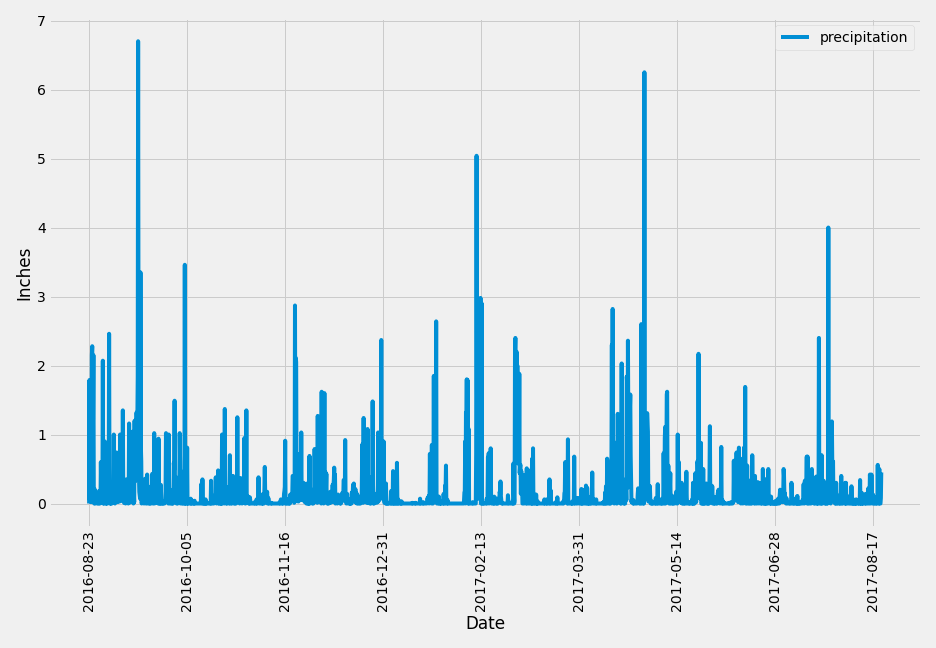
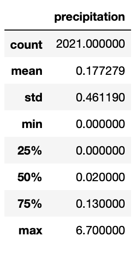
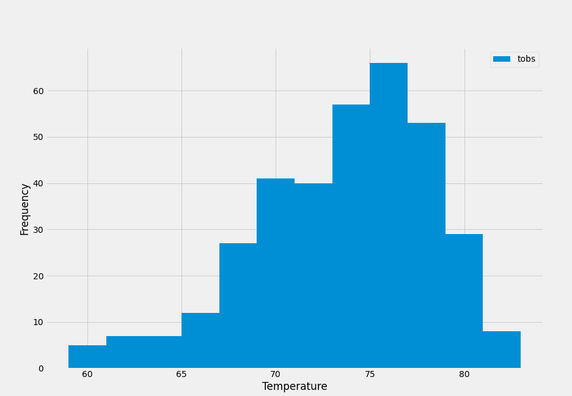
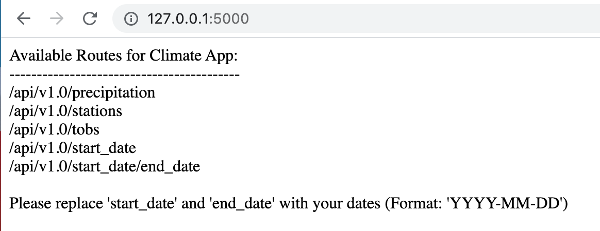

# sqlalchemy-challenge

## Climate Analysis and Exploration

This exercise includes using Python and SQLAlchemy to do basic climate analysis and data exploration of your climate database. All of the following analysis were completed using SQLAlchemy ORM queries, Pandas, and Matplotlib.

### Precipitation Analysis

* The analysis was started by finding the most recent date in the data set.
* Using this date, the last 12 months of precipitation data was retrieved by querying the 12 preceding months of data. Note you do not pass in the date as a variable to your query.
* Only the date and prcp values were selected.
* The query results were loaded into a Pandas DataFrame and the index was set to the date column.
* The DataFrame values were sorted by date.
* The results were plotted using the DataFrame plot method.

### Station Analysis

* A query was designed to calculate the total number of stations in the dataset.
* A querywas designed to find the most active stations (i.e. which stations have the most rows?).
* The stations and observation counts were in descending order.
* The station id has the highest number of observations was determined.
* Using the most active station id, the lowest, highest, and average temperature were calculated.
** Hint: Functions such as func.min, func.max, func.avg, and func.count in your queries.
* A query to retrieve the last 12 months of temperature observation data (TOBS) was designed and filtered by the station with the highest number of observations.
* The last 12 months of temperature observation data for this station were queried.
* The results as a histogram with bins=12 were plotted.

## Climate App

### Routes

* Home page.
    - All routes that are available are listed.

* /api/v1.0/precipitation
    - The query results were converted to a dictionary using date as the key and prcp as the value.
    - The JSON representation of your dictionary was returned.

* /api/v1.0/stations
    - A JSON list of stations from the dataset was returned.

* /api/v1.0/tobs
    - The dates and temperature observations of the most active station for the last year of data was queried.
    - A JSON list of temperature observations (TOBS) for the previous year returned.

* /api/v1.0/<start> and /api/v1.0/<start>/<end>
    - A JSON list of the minimum temperature, the average temperature, and the max temperature for a given start or start-end range was returned.
    - When given the start only, TMIN, TAVG, and TMAX for all dates greater than and equal to the start date was calculated.
    - When given the start and the end date, the TMIN, TAVG, and TMAX for dates between the start and end date inclusive was calculated.
  

